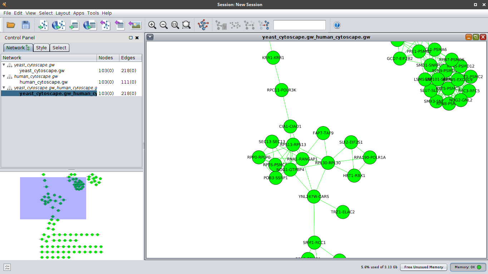
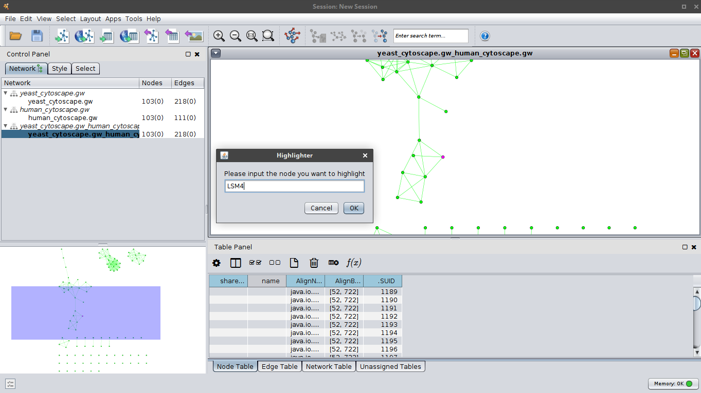
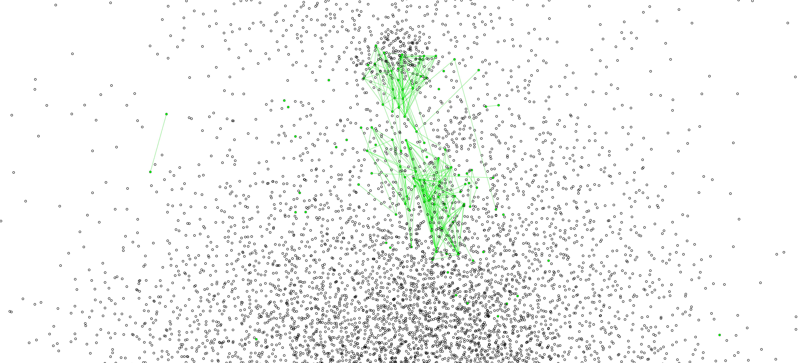
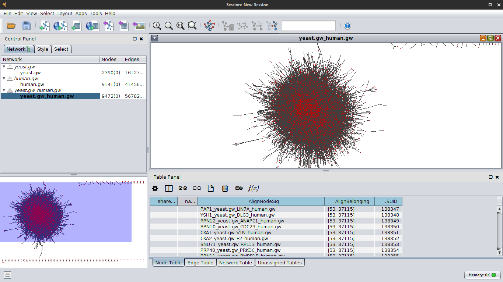
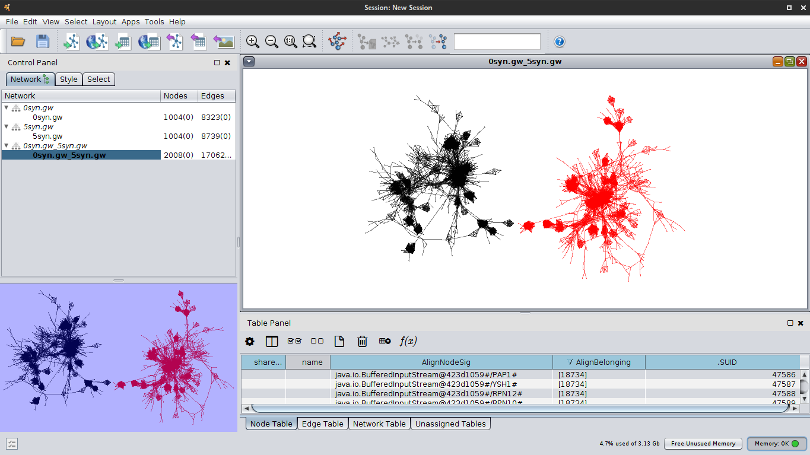
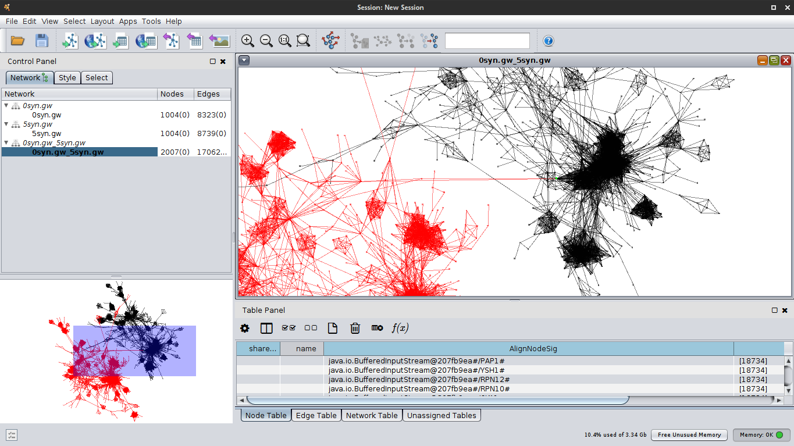

# CytoscapeAlignmentDrawer
This is an alignment drawing app for Cytoscape. To use this app, you need to have Cytoscape 3.0+ installed. Detailed instructions can be found at: http://wiki.cytoscape.org/Cytoscape_3/UserManual/AppManager. To build this software, you will need apache ANT build tool. After ANT is installed in your system, run the "make" command under the directory "alignmentdrawerplugin" which the Makefile sits in. The the java bytecode will be built and placed in the directory "alignmentdrawerplugin/dist" as a JAR package. This package is then installed into Cytoscape in the way the official document illustrates. To clean up the build directory, run the command "make clean"

# Show/hide labels 2016-4-24

# Node highlighting 2016-4-15

# Able to select desired induced subnetwork with a set of new GUI 2016-1-30
Show everything

Just the aligned network

# 1.0 - alpha 2015-12-05

